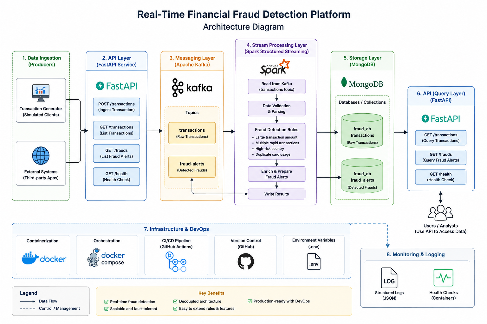

# Real-Time Financial Fraud Detection Platform

Streaming platform that ingests card transactions, runs them through Kafka and
Spark Structured Streaming, applies a set of fraud rules, and stores both the raw
transactions and any fraud alerts in MongoDB. A FastAPI service sits on top for
ingestion and querying.

```
Generator ─┐
           ├─► FastAPI (POST /transactions) ─► Kafka topic ─► Spark Streaming ─► rules ─► MongoDB ─► FastAPI (GET /transactions, /frauds)
Generator ─┘
```

## System Architecture



The standalone generator publishes directly to Kafka to create load; the API is
there for real clients and for reading results back out.

## Stack

- Python 3.12 + FastAPI
- Apache Kafka (Confluent images)
- Apache Spark 3.5 Structured Streaming (PySpark)
- MongoDB 7
- Docker Compose for local orchestration
- GitHub Actions for CI

## Fraud rules

Implemented in `spark/fraud_rules.py` and wired into the micro-batch in
`spark/streaming_job.py`. All thresholds are env-configurable.

| Code                | Trigger                                                        |
|---------------------|---------------------------------------------------------------|
| `LARGE_AMOUNT`      | `amount >= FRAUD_AMOUNT_THRESHOLD`                            |
| `HIGH_RISK_COUNTRY` | country in `FRAUD_HIGH_RISK_COUNTRIES`                         |
| `DUPLICATE_CARD`    | same card seen more than once in the batch                    |
| `RAPID_TXN`         | `>= FRAUD_RAPID_TXN_COUNT` txns for one card within the window |

A transaction that trips one or more rules is written to `fraud_alerts` with the
list of `reasons` and an aggregate `score`.

## Quick start

```bash
cp .env.example .env
docker-compose up --build
```

That brings up Zookeeper, Kafka, MongoDB, the API, the Spark job and the
transaction generator. Give it ~30s for Kafka and Spark to settle, then:

- Swagger UI: http://localhost:8000/docs
- Health:     http://localhost:8000/health

The generator starts producing immediately (including a few deliberately
suspicious transactions), so `GET /frauds` should return alerts within a minute.

## API

| Method | Path                 | Description                              |
|--------|----------------------|------------------------------------------|
| POST   | `/transactions`      | Publish a transaction to Kafka (202)     |
| GET    | `/transactions`      | List stored transactions (paginated)     |
| GET    | `/transactions/{id}` | Fetch a single transaction               |
| GET    | `/frauds`            | List fraud alerts, optional `reason` filter |
| GET    | `/health`            | Liveness + Mongo ping                    |

Example:

```bash
curl -X POST http://localhost:8000/transactions \
  -H "Content-Type: application/json" \
  -d '{"card_id":"card_1","user_id":"u1","amount":55000,"merchant":"Apple","country":"RU"}'

curl "http://localhost:8000/frauds?reason=LARGE_AMOUNT"
```

## Project layout

```
.
├── app/                     # FastAPI service
│   ├── api/                 # routers + dependency wiring
│   ├── db/                  # Mongo connection/indexes
│   ├── messaging/           # Kafka producer wrapper
│   ├── repositories/        # read-side data access
│   ├── schemas/             # Pydantic models
│   ├── services/            # application layer
│   ├── config.py            # env-driven settings
│   └── main.py              # app + lifespan
├── producer/                # standalone transaction generator
├── spark/                   # streaming job + fraud rules
├── data/                    # seed dataset
├── docker/                  # per-service Dockerfiles
├── tests/                   # pytest (API + rule tests)
├── docker-compose.yml
├── requirements.txt
└── .env.example
```

## Configuration

Everything is driven from `.env` (see `.env.example`). The most useful knobs:

- `FRAUD_AMOUNT_THRESHOLD` – large-amount cutoff
- `FRAUD_HIGH_RISK_COUNTRIES` – comma-separated ISO country codes
- `FRAUD_RAPID_TXN_COUNT` / `FRAUD_RAPID_TXN_WINDOW_SECONDS` – rapid-fire rule
- `GEN_FRAUD_RATIO` / `GEN_INTERVAL_SECONDS` – generator behaviour

## Local development

```bash
python -m venv .venv && source .venv/bin/activate
pip install -r requirements.txt

# run the API against locally running Kafka/Mongo (see docker-compose ports)
uvicorn app.main:app --reload

# run the test suite (Spark tests are skipped unless pyspark is installed)
pytest -q
```

To also run the Spark rule tests locally: `pip install -r requirements-spark.txt`.

## CI

`.github/workflows/ci.yml` runs ruff, a compile check and the test suite on every
push/PR, then builds the API and producer images and validates the compose file.

## Notes / known limitations

- The rapid-fire and duplicate-card checks are evaluated per micro-batch rather
  than over a true event-time session window. Good enough for the demo; for
  production you'd move to a stateful `groupBy(window(...))` with watermarking.
- Kafka topics are auto-created. For production, pre-create them with an explicit
  partition/replication scheme.
- No auth on the API yet — add an API key or JWT layer before exposing it.
